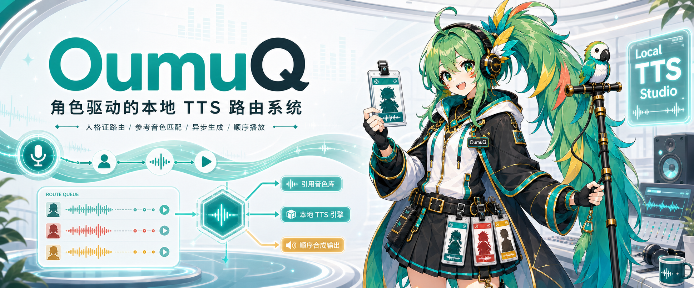

# Local TTS Studio



Local TTS Studio 是一个**角色优先的本地 TTS 路由系统**。

它不只是某个语音模型的 Web UI。它的核心目标是：先定义“谁在说话”，再根据角色配置自动选择语言、TTS 引擎、参考音频、情绪参数、生成队列和顺序播放策略。

```text
文本 -> 角色/人格 -> 语言 -> TTS 引擎 -> 参考音色 -> 异步生成 -> 顺序播放
```

这个项目适合 AI 伴侣、角色扮演 Agent、游戏配音、多语言角色语音，以及任何“说话者是谁”和“说什么”同样重要的工作流。

## 为什么做这个项目

很多本地 TTS 工具从模型出发：

```text
选择模型 -> 选择音色 -> 输入文本 -> 生成音频
```

Local TTS Studio 从角色出发：

```text
选择角色 -> 推断语言/模型/参考音/情绪 -> 提交文本 -> 异步生成 -> 按顺序播放
```

这个差异在对话系统里很重要：

- 不同角色可能使用不同语言。
- 不同语言可能更适合不同 TTS 引擎。
- 不同引擎暴露的参数不同，例如参考音频、情绪向量、采样参数、最大 token 等。
- 一个角色可能有很多参考音频，最好按正则、情绪向量、台词含义和音色风格选择最合适的一条。
- 聊天时需要“看起来很快”，所以生成应异步，播放应保持顺序。

详细设计见 [persona-routing.md](docs/persona-routing.md)。

## 核心概念

### 角色配置

角色配置描述人格和路由偏好：

- 角色 id 和显示名
- 屏幕显示语言
- 语音输出语言
- 首选 TTS 引擎
- 兜底参考音频
- 参考音频索引
- 说话风格和扮演说明

示例：

```json
{
  "id": "jp_companion",
  "name": "Japanese Companion",
  "tts_engine": "Qwen3-TTS",
  "speech_language": "Japanese",
  "visible_language": "Chinese",
  "character_folder": "voice-references/characters/jp_companion",
  "index_file": "voice-references/characters/jp_companion/voice-index.json"
}
```

### 参考音色路由

每个角色可以有多条参考音频。路由层和 worker 不应该永远使用同一条 prompt audio。

参考音频选择可以结合：

- `match_patterns`：按台词关键词或正则匹配
- `emotion_vector`：按情绪向量距离匹配
- `emotion_tags` 和 `mood`：按情绪标签匹配
- 台词与参考文本的相似度
- 参考片段时长，以及短参考音频的自动补长

如果某条参考音频太短，worker 可以把兼容片段拼成缓存用的 composite prompt WAV。

### 引擎路由

当前角色决定使用哪个引擎。

示例：

- 日语或多语言角色：Qwen3-TTS
- 中文克隆向角色：IndexTTS2
- 后续云端语音：API provider

GUI 和 Agent 集成只需要对接统一的路由契约，而不是写死某一个模型。

### 类流式队列

系统面向高频提交：

- 回车提交一行文本
- 粘贴多行文本批量入队
- 异步生成多个任务
- 播放保持提交顺序
- 按日期和时间记录每次请求

这同时支持实时聊天和批量配音生产。

## 架构

```text
Web GUI / Agent / CLI
        |
        v
Local TTS Studio 路由层
        |
        +-- 读取 voice-references/reference-index.json
        +-- 解析角色/人格
        +-- 转发规范化请求
        |
        v
常驻 TTS Worker
        |
        +-- 选择参考音频
        +-- 生成分句音频
        +-- 写入输出和缓存
        +-- 按顺序排队播放
```

当前优先支持：

- Qwen3-TTS：日语和多语言音色克隆。
- IndexTTS2：中文和本地克隆向语音。

项目不包含模型权重、生成音频、版权游戏音频或个人参考音频。

## 功能

- 基于 `voice-references/reference-index.json` 的角色选择。
- Web GUI：输入单句并按回车播放。
- 批量输入：粘贴多行快速入队。
- Worker URL 选择：支持 Qwen、IndexTTS2 和后续 API worker。
- 可选 `emotion_tags`、`emotion_vector`、`match_patterns`。
- 请求日志按 `runs/YYYY-MM-DD/HHMMSS-...` 组织。
- worker 状态轮询和最近请求列表。
- 共用参考音频匹配模块：`app/core/voice_reference.py`。

## 快速开始

```powershell
cd local-tts-studio
py -X utf8 -m venv .venv
.\.venv\Scripts\python.exe -m pip install -e .
.\.venv\Scripts\python.exe -m uvicorn app.main:app --host 127.0.0.1 --port 8780
```

打开：

```text
http://127.0.0.1:8780
```

再单独启动兼容的 TTS worker，例如：

```text
http://127.0.0.1:8765
```

## 参考音色

从 `voice-references.example` 复制一份本地 `voice-references` 目录。

默认只把元数据提交到 git。真实音频放在各角色的 `audio` 目录里，并保持本地私有。

```text
voice-references/
  reference-index.json
  characters/
    jp_companion/
      README.md
      voice-index.json
      audio/
    zh_reader/
      README.md
      voice-index.json
      audio/
```

更多说明见 [voice-references.md](docs/voice-references.md)。

## 开源注意事项

发布前确认：

- 不提交 `.venv/`
- 不提交 `runs/`
- 不提交日志文件
- 不提交真实参考音频
- 不提交模型权重或缓存
- 不提交个人路径、API key、cookie 或 token

检查清单见 [open-source-checklist.md](docs/open-source-checklist.md)。
